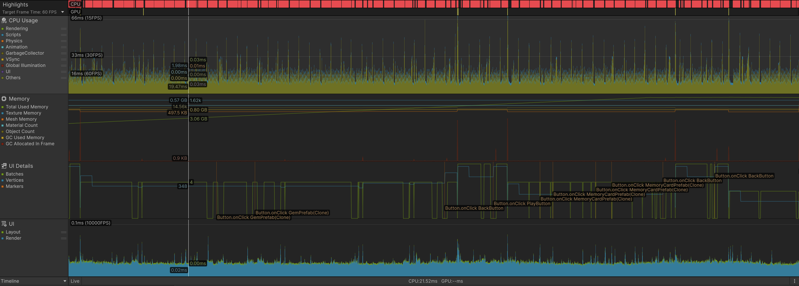

# Mini Game Framework

A Unity framework I built for creating simple mini-games with clean architecture. Currently has two working games: Match3 and Memory Card matching.

## Why This Architecture?

I wanted to avoid the common Unity pitfall of everything being tightly coupled singletons. The framework is organized into layers:

```
UI / MiniGames → Systems → Core  
```
Each layer depends on Core. UI and MiniGames both use Systems (EventManager, SceneLoader, SaveManager).

**Core** has the base patterns (Singleton, MonoSingleton, PersistentSingleton). I made three types because:
- `Singleton<T>`: Plain C# classes that don't need MonoBehaviour (like data managers)
- `MonoSingleton<T>`: Scene-specific managers that get destroyed on scene change
- `PersistentSingleton<T>`: Stuff like EventManager and SaveManager that survive scene transitions

Core is the most abstract layer with no dependencies on any other layer in the project. This means it can be reused in any Unity project.

**Systems** has EventManager, SceneLoader, and SaveManager. These are the "services" that games use. I intentionally kept them simple - EventManager just uses a dictionary of delegates.

**MiniGames** contains the actual games. Each game extends `BaseGameUI` which handles the common Unity lifecycle functions (Initialize, Update, Cleanup). This way no need to remember to unsubscribe from events in every game.

## Design Decisions

### Event System
I chose a string-based event system over Unity Events or delegates because:
- Easy to use: `EventManager.Instance.TriggerEvent(GameEvents.SCENE_LOAD_STARTED)`
- No inspector setup needed
- Games can subscribe/unsubscribe without knowing about each other

### Save System
Using PlayerPrefs with JSON serialization. I know it's not the most secure or performant solution, but:
- No external dependencies
- Works across platforms
- Good enough for high scores and simple settings
- Easy to debug (can check PlayerPrefs in editor)

If I needed shared leaderboards or cross-user rankings, I'd set up a proper backend database instead.

### Scene Management
SceneLoader handles async loading with a loading screen. I added event triggers (`SCENE_LOAD_START`, `SCENE_LOAD_COMPLETE`) so other systems can react to scene changes. The progress bar updates via coroutine checking `AsyncOperation.progress`.

### UI System
I built a theme system with ScriptableObjects. Each UITheme has colors, fonts, etc. ThemedUIElement components automatically apply the theme in `OnValidate()` so you see changes in the editor immediately.

## Current Games

### Match3
- 6x6 grid, swap adjacent gems
- Match 3+ horizontally or vertically
- 15 moves to reach target score
- Invalid swaps are allowed but swapped back

**Technical note:** Initially I was checking the entire grid for matches after each swap, which caused a bug where random matches across the board would get cleared. Fixed it by only checking around the two swapped gems.

### Memory Card Game
- 4x4 grid (16 cards, 8 pairs)
- Click to flip, match pairs
- Timer counts up, tracks moves
- Best time saved as high score

I used colors instead of sprites for cards because it was faster to test. In a real game I'd use proper card artwork.

## Adding New Mini-Games

The framework uses a config-based system for adding games without modifying existing code.

**1. Create a GameConfig asset**
```
Assets/Resources/Games/ → Right-click → Create → MiniGames → Game Config
```

Configure in Inspector:
- **Game Name**: Internal identifier (e.g., "Puzzle")
- **Display Name**: User-facing name (e.g., "Puzzle Game")
- **Description**: Short description
- **Scene Name**: Unity scene name (e.g., "PuzzleGame")
- **Theme Color**: Primary color for UI

**2. Create the game scene**
- File → New Scene → Save as `PuzzleGame.unity`
- Add to Build Settings (File → Build Settings → Add Open Scenes)

**3. Implement game logic**
```csharp
using MiniGameFramework.MiniGames;

public class PuzzleGame : MonoBehaviour
{
    protected override void OnInitialize()
    {
        // Game initialization
    }
    
    private void OnGameWin(int score)
    {
        SaveManager.Instance.SaveGameScore(GameNames.PUZZLE, score);
        // Handle win logic
    }
}
```

**4. GameRegistry automatically discovers config and GameSelectionPanel displays it.**

## Known Issues & Future Improvements

1. **Dependency injection**: Instead of singletons everywhere, use a service locator or DI container. Would make testing easier. For example, instead of `SaveManager.Instance.SaveScore()`, inject an `ISaveService` through constructor. This way it can be mock in tests without needing the actual Unity environment.

2. **Addressables**: For larger games, loading all assets at startup doesn't scale. Unity's Addressables system would be better.

3. **Better state management**: Right now game state (score, moves, time) is just private fields. Could use a proper state machine or observable pattern.

4. **Animation system**: Games feel stiff without animations. Would integrate DOTween or create a simple tween manager.

5. **Object pooling**: Currently just `Instantiate()` and `Destroy()` for gems/cards. Would pool them for better performance.

## Performance Optimizations

Basic optimizations implemented:

1. **Lazy Singleton Initialization**: Core systems (EventManager, SaveManager, SceneLoader) only initialize when first accessed, not at app start.

2. **Async Scene Loading**: SceneLoader uses `LoadSceneAsync` with progress tracking to prevent frame drops during transitions.

3. **Event Cleanup**: All games extend `BaseGameUI` which calls `Cleanup()` in `OnDestroy()`. Games override this method to remove button listeners and prevent memory leaks.

4. **Minimal Dependencies**: No heavy external libraries. Framework uses Unity's built-in systems where possible.

**Profiling Results** 

Profiled during ~33 seconds gameplay session (2000 frames, 60 FPS):

- Frame rate: Stable 60 FPS
- Frame time: 1-2ms average (well below 16.6ms budget)
- Texture Memory: 0.5 GB (constant)
- Mesh Memory: 500 KB (constant)
- Object Count: 14.5k (stable)
- GC Memory: 0.8 GB (no leaks detected)
- Material Count: 1.62k (constant)



## Code Quality Choices

I tried to follow SOLID principles:
- **Single Responsibility**: Each class does one thing (EventManager manages events, SaveManager manages saves)
- **Open/Closed**: Can add new games without modifying framework code (GameConfig system)
- **Dependency Inversion**: Games depend on interfaces/base classes, not concrete implementations

## Running the Project

Open in Unity 2022.3 or later. Main scene is `MainMenu`. Build settings already has all scenes added.

There are unit tests for EventManager and SaveManager in the Tests folder. Run them from terminal using commands below.

```bash
make test          # Run all tests
make clean         # Clean artifacts
make logs          # View logs
```
