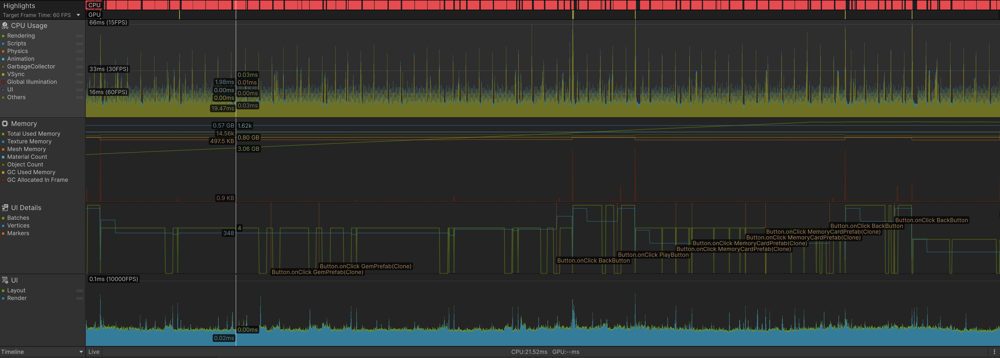

# PlayFrame

A modular Unity framework for building grid-based mini-games with clean architecture, built-in editor tooling, and a complete development-to-store pipeline.

**Unity Version:** 6000.x (URP)

---

## Architecture

The framework is organized into layered assemblies, each with explicit dependencies:

```
PlayFrame.Core        → No dependencies. Events, Singletons, Pools, Logging, State Machine.
PlayFrame.Systems     → Depends on Core. Audio, Save, Scene, Grid, Layout, Canvas, Analytics, Localization.
PlayFrame.UI          → Depends on Core + Systems. PanelManager, common panels, UIPanel base.
PlayFrame.MiniGames   → Depends on Core + Systems. Game-specific logic (Match3, Memory, etc.)
```

### Key Patterns

| Pattern | Purpose |
|---------|---------|
| `PersistentSingleton<T>` | Managers that survive scene loads (EventManager, SaveManager) |
| `MonoSingleton<T>` | Scene-scoped singletons destroyed on scene change |
| `Singleton<T>` | Plain C# singletons without MonoBehaviour |
| `EventManager` | Type-safe decoupled event system |
| `ObjectPool<T>` | Reusable object pooling |
| `StateMachine` | Finite state machine |
| ScriptableObject Configs | Inspector-configurable settings for all systems |

All systems are plug-and-play: configure via ScriptableObject, assign references in Inspector, and extend with game-specific logic. For full details, see [Systems Documentation](docs/SYSTEMS_DOCUMENTATION.md).

---

## Systems Overview

### Grid System

The core of the framework. Supports 6 interaction modes out of the box:

| Mode | Description | Example |
|------|-------------|---------|
| Tap | Click/tap on pieces | Bubble pop, whack-a-mole |
| Swap | Swap adjacent pieces | Match-3 |
| Drag | Drag pieces to positions | Jigsaw, sorting |
| MultiSelect | Select multiple pieces | Word search |
| Chain | Draw through connected pieces | Chain reaction |
| Draw | Free-form path drawing | Line drawing |

Grid configuration, board layout, piece types, and visual settings are all ScriptableObject-driven. The Board Layout Designer in the Inspector allows deterministic piece placement for level design.

### Panel Management

Stack-based panel system with 8 built-in panels (Settings, Pause, Level Complete, Level Fail, etc.). Panels support multiple display modes (overlay, exclusive, additive) and configurable animations.

### Audio System

`AudioManager` with separate music/SFX channels. `GridAudioConfig` maps grid events (place, match, swap, chain) to sound effects. Volume and mute state persists via `SaveManager`.

### Save System

PlayerPrefs-backed with JSON serialization. Handles high scores, game-specific data, settings, and localization preferences. No external dependencies.

### Scene System

Async scene loading with progress tracking and loading screen support. Scene templates (Bootstrap, Game, Loading) can be created from the editor menu.

### Localization System

Key-based localization with `LocalizedStringTable` ScriptableObjects per language. `LocalizedText` components auto-update UI text on language change. Adding a new language requires only creating a new string table asset.

### Analytics System

Extensible provider-based analytics with event batching and offline support. Built-in providers: Console Logger, Local Storage, Unity Analytics, Firebase. `BaseGame` has automatic tracking for level start/complete/fail/retry.

See [Analytics System](docs/ANALYTICS_SYSTEM.md) for provider implementation details.

### Build System

Editor tooling under **Tools → PlayFrame**:

- **Project Setup Wizard** — configure product name, company, bundle ID, and platform targets in one step
- **Build Pipeline** — one-click Dev/Prod builds for iOS and Android with auto-incrementing version and build numbers
- **Build Configs** — separate `BuildConfig_Dev` and `BuildConfig_Prod` ScriptableObjects for environment-specific settings

### Platform Integration

- **iOS:** ATT permission prompt (`IOSTrackingPermission`), Xcode post-process hook for Info.plist and signing configuration
- **Android:** IL2CPP, ARM64, AAB format, API level 28+ configured via Project Setup Wizard

---

## Getting Started

### Quick Start

1. Open project in Unity 6000.x
2. Run **Tools → PlayFrame → Project Setup Wizard** to configure identity and platforms
3. Run **Tools → PlayFrame → Build → Create Build Configs** for version management
4. Main scene: `MainMenu` (all scenes already in Build Settings)

### Creating a New Game

Create scene templates, configure `GridConfig`, choose an interaction mode, implement game logic. The framework handles grid rendering, input handling, panel UI, audio, save, and analytics.

```csharp
public class MyGame : BaseGame
{
    [SerializeField] private GridManager gridManager;

    protected override async void OnGameStart()
    {
        gridManager.OnPiecesSwapped += OnSwap;
        gridManager.InitializeGrid();
        await gridManager.FillGridAsync();
    }
}
```

See [New Game Guide](docs/NEW_GAME_GUIDE.md) for the complete walkthrough with examples for all 6 interaction modes.

---

## Performance

Profiled during ~33 seconds gameplay session (2000 frames):

| Metric | Value |
|--------|-------|
| Frame Rate | Stable 60 FPS |
| Frame Time | 1-2ms average (16.6ms budget) |
| Texture Memory | 0.5 GB (constant) |
| GC Memory | 0.8 GB (no leaks) |
| Object Count | 14.5k (stable) |



Key optimizations: lazy singleton initialization, async scene loading, automatic event cleanup in `BaseGameUI.OnDestroy()`, object pooling, no heavy external dependencies.

---

## Documentation

| Document | Description |
|----------|-------------|
| [Systems Documentation](docs/SYSTEMS_DOCUMENTATION.md) | Complete API reference for all framework systems — Grid, Panels, Layout, Audio, Save, Scene, Localization, Build, Analytics, Platform |
| [New Game Guide](docs/NEW_GAME_GUIDE.md) | Step-by-step guide: scene setup, grid configuration, interaction modes, panel integration, with code examples |
| [Memory Game Setup](docs/MEMORY_GAME_SETUP.md) | Specific setup guide for the memory card matching game |
| [Analytics System](docs/ANALYTICS_SYSTEM.md) | Analytics architecture, built-in providers, custom provider template, privacy compliance |
| [Asset Management Guide](docs/ASSET_MANAGEMENT_GUIDE.md) | Image/audio/VFX import settings, sprite atlases, build size optimization, package audit |
| [Store Preparation Guide](docs/STORE_PREPARATION_GUIDE.md) | iOS App Store & Google Play checklists, screenshots, metadata, common rejection reasons |
| [Development to Store Guide](docs/DEVELOPMENT_TO_STORE_GUIDE.md) | End-to-end 12-phase workflow: from project setup to post-launch monitoring |
| [Unity Setup Guide](docs/UNITY_SETUP_GUIDE.md) | Basic Unity scene and UI setup checklist |

---

## Project Structure

```
Assets/
├── Audio/                  # Music and SFX assets
├── GameSettings/           # ScriptableObject configs (GridConfig, BuildConfig, etc.)
├── Prefabs/                # Reusable prefabs (panels, grid pieces, UI elements)
├── Resources/              # Runtime-loaded assets (GameConfigs, themes)
├── Scenes/                 # All game scenes
├── Scripts/
│   ├── Core/               # PlayFrame.Core — base patterns, no dependencies
│   ├── Systems/            # PlayFrame.Systems — all framework systems
│   │   ├── Audio/          # AudioManager, SFXCollection, MusicCollection
│   │   ├── Build/          # BuildConfig, BuildPipeline (Editor)
│   │   ├── Grid/           # GridManager, GridConfig, GridInputHandler, interactions
│   │   ├── Localization/   # LocalizationManager, LocalizedText, string tables
│   │   ├── Platform/       # iOS ATT, Xcode post-process (Editor)
│   │   ├── Save/           # SaveManager
│   │   └── Scene/          # SceneLoaderManager, scene templates
│   ├── UI/                 # PlayFrame.UI — PanelManager, common panels
│   └── MiniGames/          # PlayFrame.MiniGames — Match3, Memory, etc.
├── Tests/                  # Edit-mode unit tests
└── UI/                     # UI assets (themes, fonts, sprites)
```

---

## Tests

```bash
make test          # Run all tests
make clean         # Clean artifacts
make logs          # View logs
```
